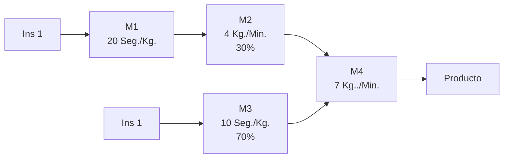

Nombre: _______________________________ Número Lista de Alumno: ______ Sección:_____

**Pontificia Universidad Católica de Chile**
**Escuela de Ingeniería**
**Departamento de Ingeniería Industrial y de Sistemas**

# Examen

**ICS 3213 Gestión de Operaciones**
**Sección 1 y Sección 2 – 1er semestre 2019**
**Prof. Alejandro Mac Cawley**
**Prof. Jorge Morales**

**Instrucciones:**

*   Poner nombre y número de lista a todas y cada una de las hojas del cuadernillo.
*   Responder todas las preguntas en el espacio asignado y no descorchetear sus hojas en ningún momento durante la prueba.
*   La prueba consta de 3 secciones.
*   No se permiten resúmenes de clases, ni de casos, ni formularios.
*   Se descontará 10 puntos por no cumplir alguna de estas instrucciones.
*   La prueba tiene 120 puntos de bono y dura 120 minutos.
*   No se pueden utilizar laptops ni celulares.
*   Se leerá la prueba al comienzo de clases y después se permitirán preguntas en voz alta. Posteriormente en la mitad de la prueba se volverá a permitir preguntas en voz alta. No se permitirán preguntas fuera de estos intervalos. Si su duda persiste indique el supuesto y continúe.
*   Este curso adscribe el Código de Honor establecido por la Escuela de Ingeniería el que es vinculante. Todo trabajo evaluado en este curso debe ser propio. En caso de que exista colaboración permitida con otros estudiantes, el trabajo deberá referenciar y atribuir correctamente dicha contribución a quien corresponda. Como estudiante es su deber conocer la versión en línea del Código de Honor (http://ing.puc.cl/codigodehonor).

_______________________________________
Firma Alumno

¡Muy Buena Suerte!

Página **1** de **10**

---

Nombre: _______________________________ Número Lista de Alumno: ______ Sección:_____

**PARTE I. (10 puntos) Sección verdadero o falso. Indique si las siguientes afirmaciones son verdaderas (V) o falsas (F). En caso de ser falsas, indique la razón.**

1. Businees Proces Modeling Notation o BPMN es mucho mejor que los flujogramas, ya que permite modelar en los procesos: actividades complejas, múltiples decisiones, flujos de información y temporalidad.
> Falso, BPMN permite modelar también los recursos y donde suceden las actividades a través de los carriles y las piscinas

2. Un diseño de línea orientado al producto es de flujo continuo y muy eficiente; pero tiene baja flexibilidad.
> Verdadero

3. Si un SKU es muy popular y se despacha con bajo numero de pickeos, (se entrega en pallets completos o semicompletos), debe ir en el área de pick frontal o rápido dado que genera altos beneficios
> Falso, un SKU de este tipo en vez de producir beneficios provocaría perjuicios al estar en el área frontal, dado que implica la perdida de espacio para sku que requieran pickeos de menor tamano

4. Al disminuir el número o nivel máximo de aceptación en un muestreo (por ej. . de 5 unidades a 3 unidades) se aumentar el Riesgo del Productor o error tipo $\alpha$.
> Verdadero
> (Si bien en el AQL esta el concepto de aceptación y en el otro el de rejection, puede llevar a confusión y que digan que ambos aceptan, uno la salida, y otro la entrada. Por ahí podría ser directamente AQL)

5. El objetivo final del Just in Time y el Lean es que el sistema productivo tenga cero inventario.
> Falso, el JIT no busca tener 0 inventario, siempre es necesario tener algo de inventario en el sistema incluso en el JIT o Lean.

Página **2** de **10**

---

Nombre: _______________________________ Número Lista de Alumno: ______ Sección:_____

**PARTE II (30 puntos) Responda solo 5 las siguientes 6 preguntas.**

a) (10 puntos) Indique al menos 2 focos de la estrategia operativa, descríbalos y comente la razón de por qué su logro permite que el sistema productivo sea una fuente de ventaja competitiva. Para cada foco indique una métrica de su logro.
> Focos de la Estrategia: Costo, Velocidad, Flexibilidad y Calidad.
> Costo: Busca el menor costo productivo en el sistema, utilizando al máximo sus recursos. Métricas: Cualquiera que se enfoque en medir el costo del proceso productivo.
> Velocidad: El sistema productivo busca mover lo mas rápido posible el producto y dar respuesta al cliente, muchas veces en des-beneficio del costo. Metricas: Cualquiera que mida los tiempos del sistema.
> Flexibilidad: El sistema productivo busca ajustarse rápidamente a las necesidades del cliente, tanto en procesos como en productos. Metricas: Cualquiera que mida tiempo de setup o ajustes del sistema.
> Calidad: El sistema busca generar la mayor calidad posible en el producto y el proceso. Métrica: cualquier indicador que mida la calidad del proceso o del producto.

b) (10 puntos) Usted tiene el siguiente proceso productivo, con sus capacidades y requerimientos porcentuales de cada insumo para producir el producto final:

Si el proceso funciona de forma continua y no es posible mantener inventarios. Indique: La capacidad productiva del proceso en Kg/Min, el cuello de botella y las necesidades de Insumo 1 e Insumo 2 en términos de Kg/Min.
> Se debe colocar todas la capacidades en los mismos términos:
> M1: 3 Kg/min
> M2: 4 Kg/Min
> M3: 6 Kg/min
> M4: 7 Kg/min.
> 
> Se pasa las capacidades a términos del producto final:
> M1: (3/0.3)=10 Kg PF/Min 
> M2: 13.33 Kg PF/Min 
> M3: 14.28 Kg PF/ min y 
> M4: 7 Kg PF/Min
> 
> Por ende el cuello de botella es la maquina 4 y el proceso tiene una capacidad de 7 Kg/ Min.
> 
> El insumo 1 debe entrar a una tasa de 2,1 Kg/Min. El insumo 2 debe entrar a una tasa de 4,9 kg/Min

(10 puntos) Demuestre matemáticamente que el suavizamiento exponencial es un modelo con memoria y a la luz de la demostración comente la razón de porque lleva este nombre.
> Se debe mostrar la recursión de la formula $F_{t+1} = \alpha A_t + (1-\alpha) F_t$, finalmente como $\alpha < 1$ el ultimo termino tiende a 0. Se llama suavizamiento exponencial, porque el ponderador que multiplica a la demanda pasada va decayendo exponencialmente.

Página **3** de **10**

---

Nombre: _______________________________ Número Lista de Alumno: ______ Sección:_____

b) (10 puntos) A continuación se le entregan los pedidos de producción para las próximas 7 semanas.

| Semana | 1 | 2 | 3 | 4 | 5 | 6 | 7 | Promedio |
| :--- | :--- | :--- | :--- | :--- | :--- | :--- | :--- | :--- |
| Pedido | 140 | 90 | 130 | 120 | 100 | 60 | 80 | 102.86 |

Si la máquina que produce el producto tiene un costo de setup de $100 cada vez que se inicia el proceso y el producto tiene un costo de inventario de $1 por semana. Determine un plan de producción utilizando el modelo de EOQ y otro plan utilizando el algoritmo de Wagner-Wittin. ¿Cuál prefiere y por qué se producen las diferencias?

> **WW**
> 
> | Semana | 1 | 2 | 3 | 4 | 5 | 6 | 7 | Promedio |
> | :--- | :--- | :--- | :--- | :--- | :--- | :--- | :--- | :--- |
> | Pedido | 140 | 90 | 130 | 120 | 100 | 60 | 80 | 102.9 |
> 
> | | | | |
> | :--- | :--- | :--- | :--- |
> | Z1 | 100 | | 100,0 |
> | P12 | 100 | 100 | 200,0 |
> | Z1 | 100 | 90 | 190,0 |
> | Z1P3 = Z2 | 100 | 90 | 100 | 290,0 ** |
> | Z1 | 100 | 220 | 130 | 450,0 |
> | | | | |
> | Z2 | | 100 | 120 | 220,0 |
> | Z2P4 | | 100 | 100 | 200,0 ** |
> | | | | |
> | Z3 | | 100 | 99 | 199,0 |
> | Z3P5 | | 100 | 100 | 200,0 |
> | Z3P6 | | 100 | 99 | 100 | 299,0 ** |
> | Z3 | | 100 | 159 | 60 | 319,0 |
> | | | | |
> | Z4 | | 100 | 80 | 180,0 ** |
> | Z4P7 | | 100 | 100 | 200,0 |
> 
> | Plan | | | | | |
> | :--- | :--- | :--- | :--- | :--- | :--- |
> | Produccion | 100 | | 100 | 100 | | 100 | | 400 |
> | Inventario | 90 | 0 | 99 | 0 | 80 | 0 | 269 |
> | | | | | Costo | 669,0 |
> 
> **EOQ**
> 
> | Q* | 143,33 | 144 | | | | | | | CT |
> | :--- | :--- | :--- | :--- | :--- | :--- | :--- | :--- | :--- | :--- |
> | Plan | 1 | 2 | 3 | 4 | 5 | 6 | 7 | |
> | Prod | 100 | 100 | 100 | 100 | | 100 | | 500 |
> | Pedidos | 140 | 90 | 130 | 120 | 100 | 60 | 80 | |
> | Producci | 144 | 144 | 144 | 144 | 144 | | | |
> | Inv | 4 | 58 | 72 | 96 | 140 | 80 | 0 | 450 |
> | | | | | | | | | 950 |
> 
> Se prefiere WW, las diferencias se producen debido a que WW produce justo lo necesario y toma en cuenta la variabilidad de la demanda.

6. (10 puntos) Usted está a cargo de un proyecto que tiene un término esperado de 32 semanas y una ruta crítica con una desviación standard de 4 semanas. Si su contraparte le ofrece un bono de $360 por terminar en o antes de una semana dada, y una penalidad de $120 por terminar por sobre dicha semana. ¿En qué semana deberá comprometerse en terminar el proyecto para quedar indiferente entre el bono y la penalidad?
> Se debe calcular la probabilidad que me deja indiferente entre el bono y la penalidad.
> $$P() = 120/(360+120) = 0.25$$
> Se obtiene el valor Z de tabla, como es simétrica, se toma el negativo de 0.75 que corresponde a 0.25 y el z respectivo seria -0.67 
> Por ende, la fecha es $= 32 – 0.67 \times 4 = 29,32 \text{ Semanas}$
> 
> ok

7. (10 puntos) ¿Qué es el six sigma y por qué difiere de la administración total de la calidad? ¿Qué es el DMAIC? ¿Qué herramienta de la calidad utiliza Six-Sigma y por qué?
> El six sigma se enfoca en el proceso y no como la calidad que se enfoca principalmente en el producto. Six sigma busca disminuir la variabilidad del proyecto y con ello, mejorar la calidad.
> DMAIC: DEFINE, Definir los cliente y sus requerimientos, MIDE: Recaba datos y fija desempeño, ANALIZA: Toma los datos y los analiza para generar información, MEJORA: En base a los datos propone mejoras al proceso y CONTROLA: Monitores que el sistema este bajo control.
> 
> La herramienta principal es el Control Estadístico de procesos a través de los gráficos de control, ya que fija limites entre los cuales el proceso esta OK.

Página **4** de **10**

---

Nombre: _______________________________ Número Lista de Alumno: ______ Sección:_____

**Pregunta 4 (25 Puntos):**

Usted es dueño de una farmacéutica y tiene un proceso compuesto por dos máquinas en serie, como se detalla en la siguiente imagen:

El insumo debe ser abierto una vez que llega el pedido del cliente al sistema, con el objetivo de verificar calidad, pasando a M1 que le hace un tratamiento especial al producto y finalmente pasa a M2 en donde es estabilizado y terminado. Debido a un proceso de maduración, el insumo deber pasar al menos una cierta cantidad de tiempo desde que es abierto, hasta que llega a M2. Calidad indica que el insumo debe pasar al menos 160 minutos en promedio en todo el proceso. Si M1 requiere de 16 minutos para terminar cada trabajo, con una distribución general del proceso y con un coeficiente de variación de 0,8. M2 tiene una capacidad de procesar un trabajo en 12 minutos, con una distribución general del proceso y un coeficiente de variación del proceso de 0,7. Si el tiempo medio de llegada entre las ordenes al proceso es de 22 minutos entre orden, distribuidos general y con un coeficiente de variación de 1.
a) (15 puntos) Suponiendo que los trabajos llegan a M2 a la tasa en que produce M1, con esta información: ¿Se cumple la restricción de que le producto debe esperar al menos 160 minutos en promedio en todo el proceso? ¿Cuánto tiempo espera el insumo? Muestre todos sus cálculos.
b) (10 puntos) ¿Cuál debería ser la utilización y la tasa de producción de M2 para que los productos en promedio esperen justo 160 minutos?

> **Respuesta parte III pregunta 4**
> 
> Para los tiempos en el sistema
> 
> | | M1 | M2 |
> | :--- | :--- | :--- |
> | VUT | | |
> | Te | 16 | 12 |
> | Ca | 1,0000 | 0,8997704 |
> | Ce | 0,8000 | 0,7 |
> | un/min | 16,0000 | 12 |
> | un/hora llegada | 22,0000 | 16 |
> | rho | 0,7273 | 0,7500 |
> 
> | | | |
> | :--- | :--- | :--- |
> | V | 0,82 | 0,64979339 |
> | U | 2,66666667 | 3 |
> | **VUT** | **34,986667** | **23,392562** |
> 
> | | | |
> | :--- | :--- | :--- |
> | cs | 0,8997704 | 0,7936115 |
> | rho^2 * ce^2 | 0,3385124 | 0,275625 |
> | (1-rho^2)*ca^2 | 0,47107438 | 0,35419421 |
> 
> Formulas incluidas:
> $$CT_q = \left( \frac{C_a^2 + C_e^2}{2} \right) \left( \frac{\rho}{1-\rho} \right) t_e$$
> $$(c_s)^2 \approx \rho^2(c_e)^2 + (1-\rho^2)(c_a)^2$$
> 
> Waiting time
> 
> | | Za | Zb |
> | :--- | :--- | :--- |
> | Tiempo en cola | 34,99 | 23,39 |
> | Tiempo Proceso | 16,00 | 12,00 |
> | **Tiempos TOTALES** | | **86,38** |

Página **5** de **10**

---

Nombre: _______________________________ Número Lista de Alumno: ______ Sección:_____

> **Respuesta parte III pregunta 4**
> 
> No se logra la espera de 160 minutos, el tiempo medio es de 86,38.
> 
> Para lograr la espera deseada debemos aumentar la espera en M2 en 73,62 Minutos.
> 
> | | |
> | :--- | :--- |
> | Aumento | 73,62 |
> | Tiempo Cola M2 | 97,01 |
> | CT/V | 149,298739 |
> | CT/Te | 12,4415616 |
> | Rho | 0,92560388 Nueva Utilizacion |
> | | |
> | Capacidad M2 | 14,8096621 |
> 
> Por ende se debe limitar la capacidad de M2 a 14,8 min/unidad para lograr la espera media de 160 minutos

Página **6** de **10**

---

Nombre: _______________________________ Número Lista de Alumno: ______ Sección:_____

**Pregunta 4 (25 Puntos):**

Usted está en el proceso de determinar las características de su centro de distribución. Como información usted ha determinado que el inventario se encuentra en su poder por un periodo promedio de 150 días hábiles y el año tiene 300 días hábiles. Por otro lado, los trabajadores de centros de distribución de este tipo tienen la capacidad de mover 30 pallets por hora y se trabaja un turno de 8 hrs al día. Usted piensa operar el CD con 10 trabajadores. La relación entre largo y ancho del centro es de 2:1 y un pallet mide 1 mt2.
a) (7 ptos) ¿Cuál debe ser las dimensiones del centro?
Una parte de los productos que vende se guardan a piso, en pallets. La demanda de pallets de estos productos y la máxima cantidad de pallets que se pueden apilar son:

| SKU | DDA. (Pallets) | Alto Apliar (Pallets) |
| :---: | :---: | :---: |
| A | 24 | 4 |
| B | 9 | 3 |
| C | 18 | 3 |
| D | 8 | 4 |

Si debe mantener un pasillo de 3 Mts de ancho y el pallet en su lado más ancho mide 1 mt.
b) (4 ptos.) Si solo puede guardar los pallets contra la muralla en 1 hilera ¿Cuál debería ser la profundidad optima?
c) (6 ptos.) Si ahora puede hacer 2 hileras, con profundidades distintas cada una ¿Cuál debería ser la profundidad? ¿Mejora el uso del espacio con respecto a la pregunta anterior?

Finalmente debe organizar el área de pick rápido o frontal. Para ello recupera la información de la demanda de los 4 SKU.

| SKU | DDA (Unidades/Mes) | Unidades/Caja | Vol. Caja (mt3/caja) |
| :---: | :---: | :---: | :---: |
| A | 15000 | 200 | 0.5 |
| B | 25000 | 300 | 0.4 |
| C | 12000 | 100 | 0.6 |
| D | 19000 | 250 | 0.3 |

d) (8 ptos.) Usted dispone de 20 MT3 en el área de pick frontal. Con esta información determine la asignación de espacio utilizando: igual tiempo, igual espacio y optima. ¿Cuál es el número de reabastecimientos mensuales que se hacen con cada asignación?

> **Respuesta parte III pregunta 4**
> 
> **Pregunta a**
> 
> | Tamano CD | Utilizamos Liitle |
> | :--- | :--- |
> | | |
> | Pallets por ano | 72000 Por trabajador |
> | Rotacion | 2 |
> | Pallets/Ano | 36000 |
> | Pallets/Ano efect | 3600 |
> | | |
> | Ancho | 42,43 |
> | Largo | 84,85 |
> | Total | 3600 |
> 
> **Pregunta b**

Página **7** de **10**

---

Nombre: _______________________________ Número Lista de Alumno: ______ Sección:_____

> | Relacion ancho | 3 | | |
> | :--- | :--- | :--- | :--- |
> | | | | |
> | **SKU** | **DDA. (Pallets)** | **Alto Apliar (Pallets)** | **Profundo** |
> | A | 24 | 4 | 6 |
> | B | 9 | 3 | 3 |
> | C | 18 | 3 | 6 |
> | D | 8 | 4 | 2 |
> | | | | |
> | | Suma | | 17 |
> | | Promedio | | 4,25 |
> | No se comparte el ancho del pasillo | Prof | | 2,524876235 |
> | | Profundidad | | 5 |
> 
> | 2 Niveles | | | | |
> | :--- | :--- | :--- | :--- | :--- |
> | **SKU** | **DDA. (Pallets)** | **Alto Apliar (Pallets)** | **Linea 1** | **Linea 2** |
> | A | 24 | 4 | 6 | |
> | B | 9 | 3 | | 3 |
> | C | 18 | 3 | 6 | |
> | D | 8 | 4 | | 2 |
> | | | | | |
> | | Suma | | 12 | 5 |
> | | Promedio | | 6 | 2,5 |
> | Se comparte el ancho del pasillo | Prof | | 3 | 1,93649167 |
> | | Profundidad | | 3 | 2 |
> 
> Es mas optimo el tener 2 lineas.
> 
> **Pregunta c**
> 
> | Espacio Disp | 20 | | | | | | | | |
> | :--- | :--- | :--- | :--- | :--- | :--- | :--- | :--- | :--- | :--- |
> | | | | | | | | | |
> | **SKU** | **Cajas** | **Vol** | **Igual Espacio** | **Reabast** | **Igual Tiempo** | **Reabast** | **Raiz** | **Optimo** | **Reabast** |
> | A | 75,00 | 37,50 | 5,00 | 7,50 | 4,53 | 8,28 | 6,12 | 4,87 | 7,70 |
> | B | 83,33 | 33,33 | 5,00 | 6,67 | 4,02 | 8,28 | 5,77 | 4,59 | 7,26 |
> | C | 120,00 | 72,00 | 5,00 | 14,40 | 8,69 | 8,28 | 8,49 | 6,75 | 10,67 |
> | D | 76,00 | 22,80 | 5,00 | 4,56 | 2,75 | 8,28 | 4,77 | 3,80 | 6,01 |
> | | | **165,63** | | **33,13** | | **33,13** | **25,16** | | **31,64** |

Página **8** de **10**

---

Nombre: _______________________________ Número Lista de Alumno: ______ Sección:_____

## Formulario

$$Q_w = \sqrt{\frac{2 C_0 D}{C_h}}$$

$$CT = DC + \frac{D}{Q}S + \frac{Q}{2}H$$

$$R = d \times L + z_\alpha \sigma \sqrt{L}$$

$$R = d * L$$

$$Q^* = d \times (T + L) + z_\alpha \sigma \sqrt{(T + L)} - I_{existente}$$

$$C_x = \frac{\sum d_i x V_i}{\sum V_i}$$

$$C_y = \frac{\sum d_i y V_i}{\sum V_i}$$

$$c_T = \frac{\sigma}{t} = \frac{\sqrt{\text{Var}(T)}}{E(T)}$$

$$\rho = \frac{\lambda}{\mu} \quad \rho = \frac{\lambda}{c\mu}$$

$$L = \lambda \times W$$

$$c_T = \frac{\sigma}{t} = \frac{\sqrt{\text{Var}(T)}}{E(T)}$$

$$L = \frac{\rho}{1-\rho}, \quad W = \frac{1}{\mu(1-\rho)}$$

$$L_q = \frac{\rho^2}{1-\rho}, \quad W_q = \frac{\rho}{\mu(1-\rho)}$$

$$WIP = TH \times TC$$

$$L = \lambda * W$$

$$A = \frac{m_f}{m_r + m_f}$$

$$t_e = \frac{t_o}{A}$$

$$\sigma^2_e = \left(\frac{\sigma^2_o}{A}\right) + \frac{(m_r + \sigma^2_r) (1 - A) t_o}{A m_r}$$

$$c^2_e = \frac{\sigma^2_e}{t_e^2} = c^2_o + (1 + c^2_r)A(1-A)\frac{m_r}{t_o}$$

$$t_e = t_o + \frac{t_s}{N_s}$$

$$\sigma^2_e = \sigma^2_o + \frac{\sigma^2_s}{N_s} + \frac{N_s - 1}{N_s^2} t^2_s$$

$$c^2_e = \frac{\sigma^2_e}{t_e^2}$$

$$CT_q = \left( \frac{C_a^2 + C_e^2}{2} \right) \left( \frac{\rho}{1-\rho} \right) t_e$$

$$(c_s)^2 \approx \rho^2(c_e)^2 + (1-\rho^2)(c_a)^2$$

$$L_q = \frac{\rho}{1-\rho} \times Prob(N>c)$$

$$L = \frac{\rho}{1-\rho} - \frac{(b+1)\rho^{b+1}}{1-\rho^{b+1}}$$

$$\lambda' = \lambda \left( \frac{1-\rho^b}{1-\rho^{b+1}} \right)$$

$$W_q = \frac{\rho}{\lambda(1-\rho)} \times Prob(N>c)$$

Página **9** de **10**

---

Nombre: _______________________________ Número Lista de Alumno: ______ Sección:_____

**Tabla de distribución normal estándar**

$$P(Z \le z) = \int_{-\infty}^{z} f(t) dt$$

| z | 0.00 | .01 | .02 | .03 | .04 | .05 | .06 | .07 | .08 | .09 |
| :--- | :--- | :--- | :--- | :--- | :--- | :--- | :--- | :--- | :--- | :--- |
| **0.0** | .5000 | .5040 | .5080 | .5120 | .5160 | .5199 | .5239 | .5279 | .5319 | .5359 |
| **0.1** | .5398 | .5438 | .5478 | .5517 | .5557 | .5596 | .5636 | .5675 | .5714 | .5753 |
| **0.2** | .5793 | .5832 | .5871 | .5910 | .5948 | .5987 | .6026 | .6064 | .6103 | .6141 |
| **0.3** | .6179 | .6217 | .6255 | .6293 | .6331 | .6368 | .6406 | .6443 | .6480 | .6517 |
| **0.4** | .6554 | .6591 | .6628 | .6664 | .6700 | .6736 | .6772 | .6808 | .6844 | .6879 |
| **0.5** | .6915 | .6950 | .6985 | .7019 | .7054 | .7088 | .7123 | .7157 | .7190 | .7224 |
| **0.6** | .7257 | .7291 | .7324 | .7357 | .7389 | .7422 | .7454 | .7486 | .7517 | .7549 |
| **0.7** | .7580 | .7611 | .7642 | .7673 | .7704 | .7734 | .7764 | .7794 | .7823 | .7852 |
| **0.8** | .7881 | .7910 | .7939 | .7967 | .7995 | .8023 | .8051 | .8078 | .8106 | .8133 |
| **0.9** | .8159 | .8186 | .8212 | .8238 | .8264 | .8289 | .8315 | .8340 | .8365 | .8389 |
| **1.0** | .8413 | .8438 | .8461 | .8485 | .8508 | .8531 | .8554 | .8577 | .8599 | .8621 |
| **1.1** | .8643 | .8665 | .8686 | .8708 | .8729 | .8749 | .8770 | .8790 | .8810 | .8830 |
| **1.2** | .8849 | .8869 | .8888 | .8907 | .8925 | .8944 | .8962 | .8980 | .8997 | .9015 |
| **1.3** | .9032 | .9049 | .9066 | .9082 | .9099 | .9115 | .9131 | .9147 | .9162 | .9177 |
| **1.4** | .9192 | .9207 | .9222 | .9236 | .9251 | .9265 | .9279 | .9292 | .9306 | .9319 |
| **1.5** | .9332 | .9345 | .9357 | .9370 | .9382 | .9394 | .9406 | .9418 | .9429 | .9441 |
| **1.6** | .9452 | .9463 | .9474 | .9484 | .9495 | .9505 | .9515 | .9525 | .9535 | .9545 |
| **1.7** | .9554 | .9564 | .9573 | .9582 | .9591 | .9599 | .9608 | .9616 | .9625 | .9633 |
| **1.8** | .9641 | .9649 | .9656 | .9664 | .9671 | .9678 | .9686 | .9693 | .9699 | .9706 |
| **1.9** | .9713 | .9719 | .9726 | .9732 | .9738 | .9744 | .9750 | .9756 | .9761 | .9767 |
| **2.0** | .9772 | .9778 | .9783 | .9788 | .9793 | .9798 | .9803 | .9808 | .9812 | .9817 |
| **2.1** | .9821 | .9826 | .9830 | .9834 | .9838 | .9842 | .9846 | .9850 | .9854 | .9857 |
| **2.2** | .9861 | .9864 | .9868 | .9871 | .9875 | .4878 | .9881 | .9884 | .9887 | .9890 |
| **2.3** | .9893 | .9896 | .9898 | .9901 | .9904 | .9906 | .9909 | .9911 | .9913 | .9916 |
| **2.4** | .9918 | .9920 | .9922 | .9925 | .9927 | .9929 | .9931 | .9932 | .9934 | .9936 |
| **2.5** | .9938 | .9940 | .9941 | .9943 | .9945 | .9946 | .9948 | .9949 | .9951 | .9952 |
| **2.6** | .9953 | .9955 | .9956 | .9957 | .9959 | .9960 | .9961 | .9962 | .9963 | .9964 |
| **2.7** | .9965 | .9966 | .9967 | .9968 | .9969 | .9970 | .9971 | .9972 | .9973 | .9974 |
| **2.8** | .9974 | .9975 | .9976 | .9977 | .9977 | .9978 | .9979 | .9979 | .9980 | .9981 |
| **2.9** | .9981 | .9982 | .9982 | .9983 | .9984 | .9984 | .9985 | .9985 | .9986 | .9986 |
| **3.0** | .9987 | .9987 | .9987 | .9988 | .9988 | .9989 | .9989 | .9989 | .9990 | .9990 |
| **3.1** | .9990 | .9991 | .9991 | .9991 | .9992 | .9992 | .9992 | .9992 | .9993 | .9993 |
| **3.2** | .9993 | .9993 | .9994 | .9994 | .9994 | .9994 | .9994 | .9995 | .9995 | .9995 |
| **3.3** | .9995 | .9995 | .9995 | .9996 | .9996 | .9996 | .9996 | .9996 | .9996 | .9997 |
| **3.4** | .9997 | .9997 | .9997 | .9997 | .9997 | .9997 | .9997 | .9997 | .9997 | .9998 |

Página **10** de **10**
