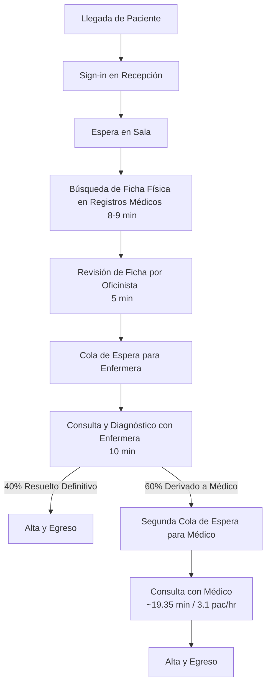
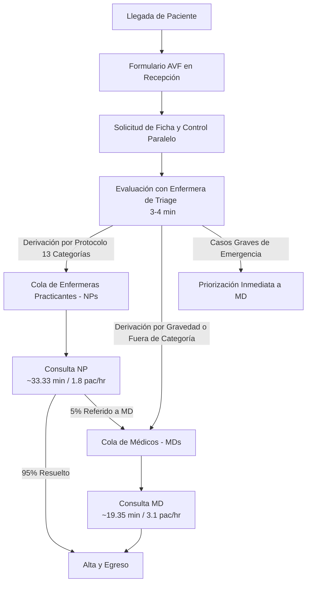

# ANÁLISIS DE CASO 4: UNIVERSITY HEALTH SERVICES (UHS)
**Curso:** Gestión de Operaciones (ICS3213)  
**Integrantes del Grupo:** César Meneses, Fabián Ortega  
**Fecha:** 29 de Mayo de 2026

---

## Pregunta 1 (3 puntos)

### 1.1. Flujograma del sistema "antiguo" y análisis de esperas y cuellos de botella

El flujo del sistema "antiguo" de la clínica Walk-In de UHS operaba de manera lineal y secuencial para los pacientes generales (que no solicitaban un médico específico):

#### ¿Dónde se generan las esperas en el sistema?
1. **Espera inicial para Enfermería:** Los pacientes esperaban un promedio de **23 minutos** desde su llegada hasta su primer contacto físico con la enfermera. El 22% de los pacientes experimentaba esperas de más de 35 minutos.
2. **Espera administrativa (Búsqueda de fichas):** Se generaba una demora de 8 a 9 minutos para traer físicamente el historial médico desde el departamento de registros, a lo que se sumaban 5 minutos del oficinista para verificar datos y reportes de laboratorio.
3. **Espera intermedia (Derivación):** El 60% de los pacientes que requerían ver a un médico debían volver a la sala de espera, experimentando un retraso promedio de **10 minutos** entre la consulta de enfermería y la del médico.
4. **Espera por preferencias (Médicos Específicos):** Los pacientes que solicitaban ver a un médico específico (19% de la demanda total) esperaban un promedio de **40 minutos** en sala sin pasar por el filtro de enfermería.

#### ¿Cuál es el cuello de botella?
El cuello de botella del sistema se concentraba en la **etapa de consulta de enfermería**. Dado que el 100% de los pacientes debían pasar obligatoriamente por una sesión de diagnóstico de 10 minutos con una enfermera, pero las enfermeras solo resolvían definitivamente el 40% de los casos, la capacidad del equipo de enfermeras se saturaba atendiendo derivaciones redundantes. Esto obligaba a duplicar esfuerzos de diagnóstico en el 60% de los pacientes que de todas formas requerían atención médica.

---

### 1.2. Problemas, métricas y variabilidad del sistema antiguo

#### Problemas del sistema antiguo (3 señalados):
1. **Tiempos de espera excesivos e impredecibles:** Los pacientes sufrían largas demoras en la sala de espera que no se correlacionaban con la urgencia ni simplicidad de sus dolencias (por ejemplo, esperar casi una hora por una renovación de receta).
2. **Duplicación ineficiente de esfuerzos médicos:** El 60% de los pacientes pasaba por dos revisiones completas e independientes (enfermera + médico), repitiendo preguntas y exámenes físicos básicos, lo que reducía la productividad global del personal.
3. **Mala percepción del servicio:** La sala de espera saturada y el trato secuencial frío generaban descontento generalizado. Muchos pacientes evitaban atenderse en la clínica por miedo a la espera, afectando la prevención en salud.

#### Métricas en que se reflejaban (3 señaladas):
1. **Tiempo de espera promedio al primer contacto:** Promediaba **23 minutos** en sala de espera.
2. **Porcentaje de colas críticas:** El **22%** de los pacientes esperaba más de 35 minutos para ver a la enfermera.
3. **Tasa de derivación médica:** El **60%** de los pacientes de enfermería eran derivados.
4. **Tiempo de espera en derivación:** Promediaba **10 minutos** entre la atención de enfermería y la del médico.

#### Variabilidad del sistema (3 señaladas):
1. **Variabilidad en la tasa de llegada de pacientes:** Existe una alta variabilidad de demanda por hora. Los pacientes llegaban de manera concentrada durante las horas intermedias del día (con picos de 18.2 llegadas/hr de 8-9 AM y 17.6 de 9-10 AM), mientras que al final de la jornada (5-6 PM) caían abruptamente a 2.8 llegadas/hr.
2. **Variabilidad en los tiempos de servicio (Severidad):** El tiempo necesario para atender una dolencia varía drásticamente (desde un resfrío simple o lavado de oído de 5 minutos, hasta una apendicitis o dolor de pecho de 30-40 minutos).
3. **Variabilidad por solicitudes específicas:** El 19% de los pacientes exigía ser atendido por un médico en particular, impidiendo la optimización mediante unifila y sobrecargando a ciertos médicos mientras otros tenían baja utilización.

---

### 1.3. Flujograma del sistema "nuevo" (Triage) y su impacto en esperas y variabilidad

El sistema "nuevo" introdujo un sistema de **Triage** coordinado por enfermeras altamente experimentadas para filtrar y segmentar la demanda desde la entrada:

#### ¿Cuál es la mayor diferencia?
La principal diferencia es la **paralelización y segmentación de flujos**. Se elimina el flujo en serie (enfermera $\to$ médico). Ahora, la enfermera de triage realiza una evaluación muy rápida de 3-4 minutos y divide a los pacientes en dos colas paralelas separadas según la complejidad del caso (NPs para dolencias menores por protocolo; MDs para diagnósticos avanzados).

#### ¿Cómo se hace cargo de las esperas y la variabilidad?
- **Esperas:** Los pacientes simples ya no bloquean la fila médica, y el proceso administrativo de búsqueda física de fichas se ejecuta en paralelo con el tiempo de espera del paciente para ingresar a triage.
- **Variabilidad:** El triage actúa como un \"enrutador\" que absorbe la variabilidad de severidad del paciente en la entrada, direccionándolo al recurso adecuado. En períodos de alta demanda, las coordinadoras redirigen dinámicamente casos dudosos hacia los médicos para aliviar las colas de las NPs.

#### ¿En qué métrica se debería reflejar?
Debería reflejarse en un menor tiempo total en la clínica ($CT$), en la tasa de resolución directa de las NPs (cercana al 95% sin derivaciones adicionales), y en tiempos de espera en cola más balanceados entre médicos y NPs.

#### ¿Por qué debería ser mejor?
Es mejor porque elimina la redundancia en la atención del 60% de los pacientes. Al segmentar por complejidad, se aprovecha de manera óptima la capacidad y el costo de los médicos para tareas de alto diagnóstico y se da autonomía a las NPs bajo guías médicas (13 categorías), acortando los tiempos de procesamiento unitario globales.

---

## Pregunta 2 (3 puntos)

### 2.1. Determinación de la utilización del sistema (8 AM a 5 PM)

La utilización ($\rho = \lambda / (c \cdot \mu)$) se calcula dividiendo la carga de trabajo demandada (horas de consulta requeridas) por la capacidad disponible programada en ese bloque (horas de atención).

#### Datos de Partida:
- Tasa de atención del médico: $\mu_{MD} = 3.1$ pac/hr ($19.35\,\text{min/pac}$).
- Tasa de atención de NPs: $\mu_{NP} = 1.8$ pac/hr ($33.33\,\text{min/pac}$).
- Distribución de pacientes según Triage: $67\%$ a Médicos, $33\%$ a NPs.

#### Cálculos para Día Promedio (140.2 llegadas en 9 horas):
- Demanda MD = $140.2 \times 0.67 = 93.93$ pacientes. Horas de doctor requeridas = $93.93 / 3.1 = 30.30\,\text{horas}$.
- Horas MD disponibles programadas = $28.0\,\text{horas}$ (según Exhibit 4).
- **Utilización Médicos ($\rho_{MD}$) = $30.30 / 28.0 = \mathbf{108.2\%}$** (Saturado/Inestable).
- Demanda NP = $140.2 \times 0.33 = 46.27$ pacientes. Horas NP requeridas = $46.27 / 1.8 = 25.70\,\text{horas}$.
- Horas NP disponibles programadas = $29.5\,\text{horas}$.
- **Utilización NPs ($\rho_{NP}$) = $25.70 / 29.5 = \mathbf{87.1\%}$** (Estable).
- Utilización combinada del sistema (en horas): $(30.30 + 25.70) / (28.0 + 29.5) = \mathbf{97.4\%}$.

#### Cálculos para Lunes (Peak de 159.8 llegadas en 9 horas):
- Demanda MD = $159.8 \times 0.67 = 107.07$ pacientes. Horas de doctor requeridas = $107.07 / 3.1 = 34.54\,\text{horas}$.
- Horas MD disponibles programadas = $28.5\,\text{horas}$ (según Exhibit 4).
- **Utilización Médicos ($\rho_{MD, Lunes}$) = $34.54 / 28.5 = \mathbf{121.2\%}$** (Altamente Inestable).
- Demanda NP = $159.8 \times 0.33 = 52.74$ pacientes. Horas NP requeridas = $52.74 / 1.8 = 29.30\,\text{horas}$.
- Horas NP disponibles programadas = $29.5\,\text{horas}$.
- **Utilización NPs ($\rho_{NP, Lunes}$) = $29.30 / 29.5 = \mathbf{99.3\%}$** (Al borde de la inestabilidad).
- Utilización combinada del sistema (en horas): $(34.54 + 29.30) / (28.5 + 29.5) = \mathbf{110.1\%}$.

---

### 2.2 y 2.3. Cantidad necesaria de doctores y tiempos de espera teóricos (Wq)

Calculamos el número de médicos necesarios ($c$) para operar a niveles de utilización de 100%, 90%, 75% y 60%, y estimamos el tiempo de espera promedio en cola ($W_q$ en minutos) para los pacientes en la cola médica mediante el modelo de teoría de colas $M/M/c$ (asumiendo variables enteras en la práctica).

#### Tabla de Requerimientos y Esperas para Médicos (MDs):

| Caso Evaluado | Utilización Objetivo | Doctores Cont. (c) | Doctores Disc. (c) | Utilización Real | Espera Teórica en Cola ($W_q$) |
| :--- | :---: | :---: | :---: | :---: | :---: |
| **Día Promedio** | 100% | 3.37 | 3 | 112.2% | $\infty$ (Cola infinita) |
| ($\lambda_{MD} = 10.44$ pac/hr) | 90% | 3.74 | 4 | 84.2% | **20.6 minutos** |
| | 75% | 4.49 | 5 | 67.3% | **4.0 minutos** |
| | 60% | 5.61 | 6 | 56.1% | **1.1 minutos** |
| **Lunes (Peak)** | 100% | 3.84 | 3 | 127.9% | $\infty$ (Cola infinita) |
| ($\lambda_{MD} = 11.90$ pac/hr) | 90% | 4.26 | 4 | 95.9% | **108.7 minutos** (~1.8 horas) |
| | 75% | 5.12 | 5 | 76.8% | **8.2 minutos** |
| | 60% | 6.40 | 6 | 64.0% | **2.2 minutos** |

*Nota: La espera teórica $W_q$ se calculó usando la ecuación de Erlang C para el número entero de doctores (Doctores Discretos).*

---

### 2.4. ¿Qué haría usted? Propuesta de asignación y justificación

#### Propuesta de Asignación:
Se propone programar de manera permanente **5 médicos (MDs) en promedio de martes a viernes** (logrando una utilización de 67.3%), y aumentar la capacidad a **6 médicos (MDs) durante los días lunes** (logrando una utilización de 64.0%).

#### Justificación Operacional y Económica:
1. **Evitar el colapso del lunes:** El análisis demuestra que tener 4 médicos el lunes (95.9% de utilización) colapsa la clínica con esperas de casi 2 horas. Al subir a 5 o 6 médicos, el tiempo de espera cae por debajo de los 10 minutos (8.2 y 2.2 mins respectivamente), cumpliendo la meta administrativa de UHS de dar un servicio rápido.
2. **Absorción de "Citas de Walk-In":** El caso reporta que hasta el 40% de la capacidad de algunos doctores se destina a citas informales programadas a espaldas del sistema. Contar con un colchón de capacidad ociosa (operando a un 75% o 60% de utilización teórica) es vital para absorber esta demanda oculta sin colapsar la sala de espera para los verdaderos pacientes espontáneos.
3. **Bajo costo relativo de capacidad:** Los sueldos de los médicos representan aproximadamente $\$45,000$ anuales. El costo de operar con 1 médico adicional el lunes es insignificante comparado con la mejora en satisfacción de pacientes y la eliminación de horas extras del personal de enfermería y recepción que debe quedarse después de las 6:00 PM para despachar las colas acumuladas.

---

### 2.5. Resultados del modelo de simulación y propuestas de solución

Se desarrolló un modelo de simulación de eventos discretos en Python para simular la dinámica diaria de la clínica. El modelo simula las llegadas por procesos de Poisson, el paso de 3.5 minutos por la cola de Triage (2 servidores), y la cola en los médicos (MDs) o enfermeras (NPs) con el personal programado variable por hora.

#### Resultados de la Simulación (1,000 iteraciones):

| Escenario Simulado | Espera Triage (min) | Espera MD (min) | Espera NP (min) | Rezagados/Día (Cola a las 6:00 PM) |
| :--- | :---: | :---: | :---: | :---: |
| **Día Prom. - Baseline** | 0.52 | 37.00 | 23.46 | 4.09 pacientes |
| **Día Prom. - Solución 1 (Sin Citas Espec.)** | 0.52 | 35.52 | 20.55 | 3.75 pacientes |
| **Día Prom. - Solución 2 (Expandir NP 50%)** | 0.53 | 18.18 | 69.03 | 9.81 pacientes |
| **Día Prom. - Solución Combinada** | 0.52 | 15.85 | 65.06 | 9.18 pacientes |
| **Lunes - Baseline** | 0.72 | 36.57 | 25.24 | 5.29 pacientes |
| **Lunes - Solución 1 (Sin Citas Espec.)** | 0.76 | 34.55 | 23.47 | 5.26 pacientes |
| **Lunes - Solución 2 (Expandir NP 50%)** | 0.73 | 17.85 | 96.29 | 16.54 pacientes |
| **Lunes - Solución Combinada** | 0.75 | 15.86 | 95.67 | 16.16 pacientes |

#### Análisis y Propuesta de Soluciones:

- **Solución 1: Eliminar Solicitud de Médicos Específicos (Pooling de Capacidad):**
  - *Descripción:* Los pacientes ya no pueden solicitar un doctor en particular en el Walk-In; son atendidos por el primero disponible.
  - *Impacto:* Al unificar la cola en un pool perfecto, la espera de los médicos cae de 37.0 a 35.5 minutos en promedio. Se reduce la varianza y se aprovecha mejor la capacidad de los doctores sin incurrir en costos de contratación.
  
- **Solución 2: Expandir las Guías Clínicas de las NPs (Traspaso de Carga a NPs):**
  - *Descripción:* Aumentar los protocolos de 13 a más categorías para que el 50% de los pacientes se deriven a NPs (en lugar del 33%).
  - *Impacto:* La espera médica se desploma a la mitad (18.18 mins). Sin embargo, al no cambiar el personal de NPs, su cola explota de 23.4 a 69.0 minutos y los pacientes no atendidos suben a 9.81 por día.
  - *Recomendación:* Esta solución **solo es viable si se acompaña con un incremento de la capacidad de NPs** (contratando o reasignando horas de NPs de tareas administrativas), lo cual lograría el óptimo global del sistema (esperas inferiores a 16 minutos para médicos).
